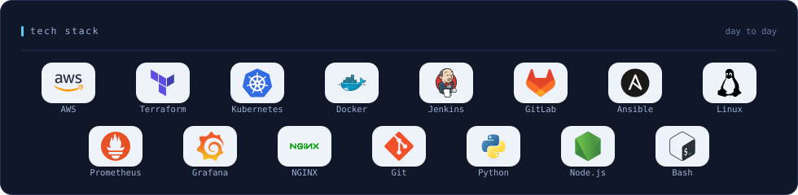
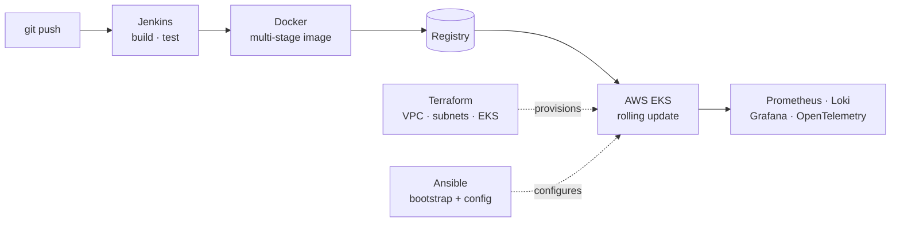
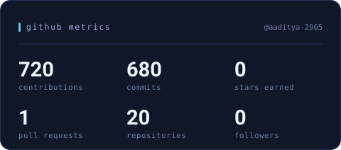
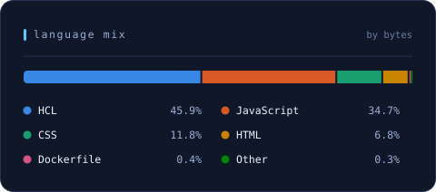
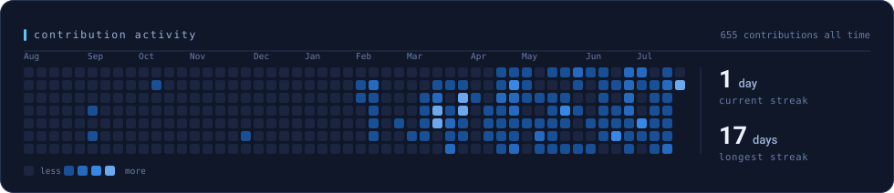

## 🧑‍💻 About Me

```hcl
resource "human" "aadityasinh_zala" {
  role  = "DevOps Engineer"
  focus = ["cloud infrastructure", "CI/CD", "automation"]

  stack = {
    cloud         = ["AWS"]
    iac           = ["Terraform", "Ansible"]
    containers    = ["Docker", "Kubernetes"]
    pipelines     = ["Jenkins", "GitLab CI"]
    observability = ["Prometheus", "Grafana", "Loki", "OpenTelemetry"]
    languages     = ["Python", "Bash", "JavaScript"]
  }

  currently_building = "multi-region cross-failover infrastructure"
  interests          = ["scalable systems", "modular architecture"]

  lifecycle {
    prevent_destroy = true
  }
}
```

---

## 🛠️ Tech Stack



---

## 🚀 Projects

### 🔹 Sportsphere

* MERN stack application for sports tournament & team management, containerized with Docker.
* CI/CD pipeline powered by Jenkins, deploying to Kubernetes on AWS cloud.
* Features automated scheduling, team registration, match handling, and scalable infra design.

<details>
<summary>⚙️ <strong>DevOps Highlights</strong> (click to expand)</summary>
<br>



| Layer | Tool / Tech | Details |
|-------|------------|----------|
| 🐳 **Containerization** | Docker, Docker Compose | Multi-stage Dockerfiles for frontend & backend with docker compose, optimized image sizes & enhanced security |
| 🔄 **CI/CD** | Jenkins | Automated build → test → push → deploy pipeline via Jenkinsfile |
| ☸️ **Orchestration** | Kubernetes | Deployment manifests, services & ingress for rolling updates on AWS EKS |
| 🏗️ **IaC** | Terraform | Infrastructure provisioned as code — VPC, subnets, EKS cluster |
| 📦 **Config Mgmt** | Ansible | Playbooks for server bootstrapping & environment configuration |
| ☁️ **Cloud** | AWS | S3 + CloudFront (frontend), EKS (backend) |
| 📊 **Monitoring** | Prometheus, Loki, Grafana, OpenTelemetry | Logs, traces, metrics & alarms for infra and application health |

</details>

---

### 🔹 Multi-Region cross-failover Infrastructure

* Designed multi-region infra using Terraform wrappers
* Implemented CI/CD with job separation strategy
* Focus on scalability & modular architecture

---

### 🔹 Car Catalogue

* Static web project
* Built using HTML/CSS
* Clean UI for showcasing car data

---

## 📊 GitHub Stats

<p align="center">
  
  
</p>



<sub>These cards are rendered by [a GitHub Action](.github/workflows/profile-cards.yml) on a daily schedule and committed to [`assets/`](assets/) — so they load from this repo rather than a third-party image service that can cold-start and time out behind GitHub's image proxy.</sub>

---

## 🌐 Connect With Me

* 💼 LinkedIn: [aadityasinh-zala](https://linkedin.com/in/aadityasinh-zala)

---

<p align="center">
  ⭐ From <a href="https://github.com/aaditya-2905">aaditya-2905</a>
</p>
